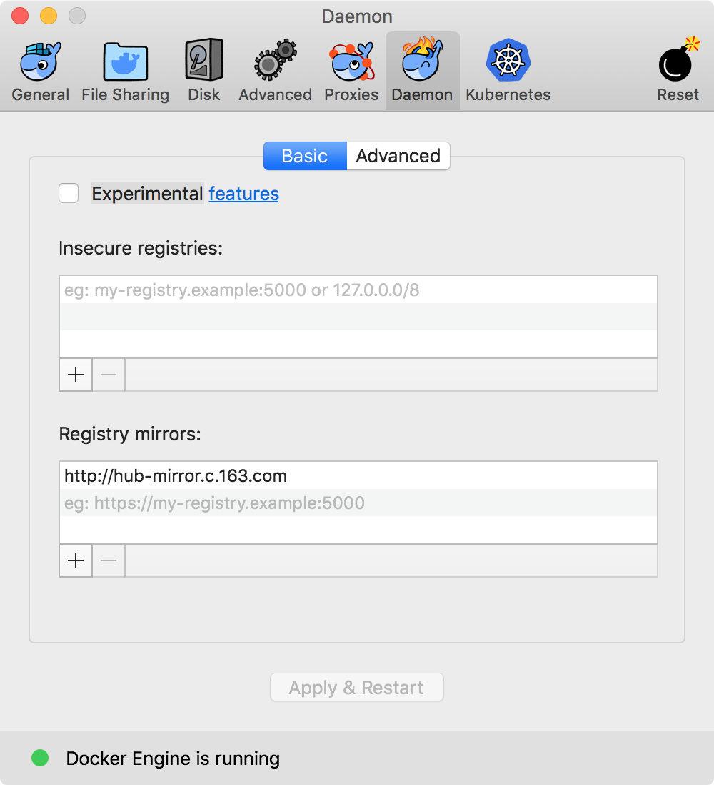

# MacOS Docker 安装

## Homebrew 安装

macOS 我们可以使用 Homebrew 来安装 Docker。
Homebrew 的 Cask 已经支持 Docker for Mac，因此可以很方便的使用 Homebrew Cask 来进行安装：

```shell
# 安装命令
brew cask install docker

==> Satisfying dependencies
==> Downloading https://download.docker.com/mac/stable/28905/Docker.dmg
######################################################################## 100.0%
==> Verifying SHA-256 checksum for Cask 'docker'.
==> Installing Cask docker
==> Moving App 'Docker.app' to '/Applications/Docker.app'.
🍺  docker was successfully installed!
```
从应用中找到 Docker 图标并点击运行，点击 Next，可能会询问你的 macOS 登陆密码，你输入即可。之后会弹出一个 Docker 运行的提示窗口，状态栏上也有有个小鲸鱼的图标（）

## 手动下载安装

如果需要手动下载，请点击以下链接下载 Stable 或 Edge 版本的 Docker for Mac。
如同 macOS 其它软件一样，安装也非常简单，双击下载的 .dmg 文件，然后将鲸鱼图标拖拽到 Application 文件夹即可。


从应用中找到 Docker 图标并点击运行。可能会询问 macOS 的登陆密码，输入即可。

点击顶部状态栏中的鲸鱼图标会弹出操作菜单。


刚安装完，可能会看到安装成功的界面

启动终端后，通过命令可以检查安装后的 Docker 版本
```shell
~ docker version
Client: Docker Engine - Community
 Version:           18.09.0
 API version:       1.39
 Go version:        go1.10.4
 Git commit:        4d60db4
 Built:             Wed Nov  7 00:47:43 2018
 OS/Arch:           darwin/amd64
 Experimental:      false

Server: Docker Engine - Community
 Engine:
  Version:          18.09.0
  API version:      1.39 (minimum version 1.12)
  Go version:       go1.10.4
  Git commit:       4d60db4
  Built:            Wed Nov  7 00:55:00 2018
  OS/Arch:          linux/amd64
  Experimental:     false
  
~ docker --version
Docker version 18.09.0, build 4d60db4

~ docker -v
Docker version 18.09.0, build 4d60db4
```
## 镜像加速

鉴于国内网络问题，后续拉取 Docker 镜像十分缓慢，我们需要配置加速器来解决，网易的镜像地址：`http://hub-mirror.c.163.com`

在顶部状态栏点击 鲸鱼图标 -> Perferences... -> Daemon -> Registry mirrors。在列表中填写加速器地址即可。修改完成之后，点击 Apply & Restart 按钮，Docker 就会重启并应用配置的镜像地址了。



之后我们可以通过 docker info 来查看是否配置成功
```shell
~ docker info
...
Registry Mirrors:
 http://hub-mirror.c.163.com/
Live Restore Enabled: false
Product License: Community Engine
```

# Docker 使用

## 查看版本信息

```bash
# 查看docker相关信息
docker info

# 查看版本信息
docker -v 或者 docker --version

# 查看Client和Server版本信息
docker version
```

## docker run 命令

Docker 允许你在容器内运行应用程序， 使用 `docker run`命令来在容器内运行一个应用程序。

`docker run ubuntu:15.10 /bin/echo "Hello world"`
各个参数解析：

 * docker: Docker 的二进制执行文件。
 * run:与前面的 docker 组合来运行一个容器。
 * ubuntu:15.10指定要运行的镜像，Docker首先从本地主机上查找镜像是否存在，如果不存在，Docker 就会从镜像仓库 Docker Hub 下载公共镜像。
 * /bin/echo "Hello world": 在启动的容器里执行的命令

以上命令完整的意思可以解释为：Docker 以 ubuntu15.10 镜像创建一个新容器，然后在容器里执行 bin/echo "Hello world"，然后输出结果。

`docker run -i -t ubuntu:15.10 /bin/bash`
各个参数解析：

 * -t:在新容器内指定一个伪终端或终端
 * -i:允许你对容器内的标准输入 (STDIN) 进行交互

此时我们已进入一个 ubuntu15.10系统的容器

在容器中运行命令 cat /proc/version和ls分别查看当前系统的版本信息和当前目录下的文件列表

```bash
root@37017c93983f:/# ls
bin  boot  dev  etc  home  lib  lib64  media  mnt  opt  proc  root  run  sbin  srv  sys  tmp  usr  var
root@37017c93983f:/# cat /proc/version
Linux version 4.9.125-linuxkit (root@659b6d51c354) (gcc version 6.4.0 (Alpine 6.4.0) ) #1 SMP Fri Sep 7 08:20:28 UTC 2018
root@37017c93983f:/#
```
通过运行`exit`命令或者使用`CTRL+D`来退出容器


启动容器（后台模式）: 使用以下命令创建一个以进程方式运行的容器
`docker run -d ubuntu:15.10 /bin/sh -c "while true; do echo hello world; sleep 1; done"`

通过`docker ps` 来查看容器情况

## docker stop 命令

 使用`docker stop` 命令来停止容器
 
 `docker stop [容器ID|容器名]`
 
 