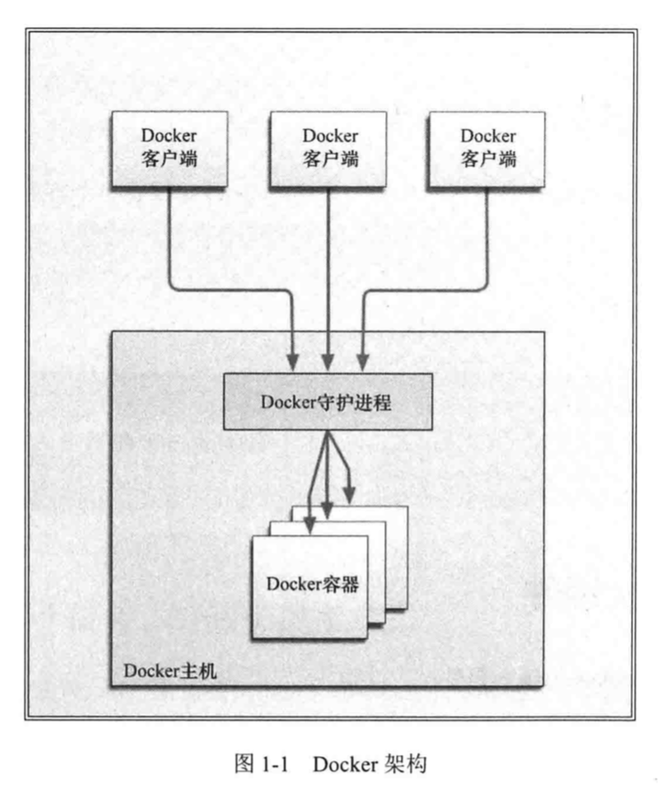

Docker 是一个能够把开发的应用程序自动部署到容器的开源引擎。
Docker 在虚拟化的容器执行环境中增加了一个应用程序部署引擎。该引擎的目标就是提供一个轻量、快速的环境，能够运行开发者的程序，并方便高效地将程序从开发者的笔记本部署到测试环境，然后再部署到生产环境。

# Docker组件

## 1. Docker 客户端和服务器

Docker 是一个客户 - 服务器（C/S）架构的程序。Docker 客户端只需向 Docker 服务器或守护进程发出请求，服务器或守护进程将完成所有工作并返回结果。Docker 提供了一个命令行工具 docker 以及一整套 RESTful API。你可以在同一台宿主机上运行 Docker 守护进程和客户端，也可以从本地的 Docker 客户端连接到运行在另一台宿主机上的远程 Docker 守护进程。

安装好的Docker有两个程序：Docker服务端和Docker客户端。其中Docker服务进程，管理着所有的容器。Docker 客户端则扮演着Docker服务端的远程控制器，可以用来控制 Docker 的服务端进程。**大部分的情况下，Docker服务端和客户端运行在一台机器上。**

## 2. Docker镜像

镜像是构建 Docker 世界的基石。用户基于镜像来运行自己的容器。镜像也是 Docker 生命周期中的“构建”部分。镜像是基于（Union）文件系统的一种层式结构，由一系列指令一步一步构建出来。

也可以把镜像当作容器的“源代码”。镜像体积很小，非常“便携”，易于分享、存储和更新。

## 3. Registry

Docker 用 Registry 来保存用户构建的镜像。Registry 分为公共和私有两种。Docker 公司运营的公共 Registry 叫做 Docker Hub。用户可以在 Docker Hub 注册账户，分享并保存自己的镜像。

## 4. Docker容器

Docker 可以帮你构建和部署容器，你只需要把自己的应用程序或服务打包放进容器即可。容器是基于镜像启动起来的，容器中可以运行一个或多个进程。我们可以认为，镜像是 Docker 生命周期中的构建或打包阶段，而容器则是启动或执行阶段。

总结起来，Docker 容器就是：
* 一个镜像格式；
* 一系列标准的操作；
* 一个执行环境；
Docker 借鉴了标准集装箱的概念。

# 构建镜像

构建 Docker 镜像有以下两种方法：

* 使用 docker commit 命令
* 使用 docker build 命令和 Dockerfile 文件

推荐使用被称为 Dockerfile 的定义文件和 docker build 命令来构建镜像。Dockerfile 使用基本的基于 DSL 语法的指令来构建一个 Docker 镜像，之后使用 docker build 命令基于该 Dockerfile 中的指令构建一个新的镜像。

创建一个文件夹用来保存 Dockerfile，这个文件夹就是我们的构建环境（build environment），Docker 则称此环境为上下文（context）或者构建上下文（build context）。Docker 会在构建镜像时将构建上下文和该上下文中的文件和目录上传到 Docker 守护进程。这样 Docker 守护进程就能直接访问你想在镜像中存储的任何代码、文件或者其他数据。

Dockerfile 由一系列指令和参数组成。每条指令都必须为大写字母，且后面要跟随一个参数。Dockerfile 中的指令会按顺序从上到下执行，所以应该根据需要合理安排指令的顺序。

每条指令都会创建一个新的镜像层并对镜像进行提交。Docker 大体上按照如下流程执行 Dockerfile 中的指令。
* Docker 从基础镜像运行一个容器。
* 执行一条指令，对容器做出修改。
* 执行类似 docker commit 的操作，提交一个新的镜像层。
* Docker 再基于刚提交的镜像运行一个新容器。
* 执行 Dockerfile 中的下一条指令，直到所有指令都执行完毕。

Dockerfile 也支持注释。以 # 开头的行都会被认为是注释。
每个 Dockerfile 的第一条指令都应该是 FROM。FROM 指令指定一个已经存在的镜像，后续指令都将基于该镜像进行，这个镜像被称为基础镜像（base image）。

