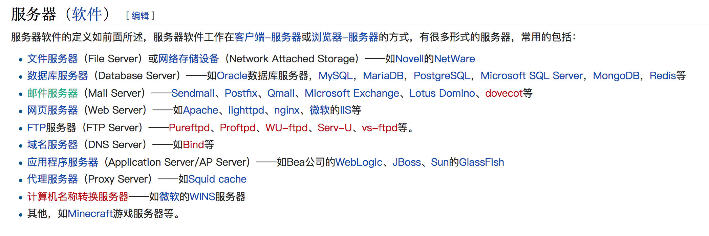

# Nginx

Nginx('engine x')是一款由俄罗斯的程序设计师Igor Sysoev（伊戈尔·赛索耶夫）所开发 高性能的**HTTP和反向代理**服务，也是一个IMAP/POP3/SMTP服务。在高连接并发的情况下，Nginx是Apache服务器不错的替代品

Nginx是一款轻量级的**Web 服务器/反向代理服务器及电子邮件（IMAP/POP3）代理服务器**，并在一个BSD-like 协议下发行。其特点是占有内存少，并发能力强，事实上nginx的并发能力确实在同类型的网页服务器中表现较好，中国大陆使用nginx网站用户有：百度、京东、新浪、网易、腾讯、淘宝等。

Nginx 是一个安装非常的简单、配置文件非常简洁（还能够支持perl语法）、Bug非常少的服务。Nginx 启动特别容易，并且几乎可以做到7*24不间断运行，即使运行数个月也不需要重新启动。你还能够不间断服务的情况下进行软件版本的升级。

## 模块依赖

1. gzip模块需要 zlib 库
2. rewrite模块需要 pcre 库
3. ssl 功能需要openssl库

## 版本发布

第一个公开版本0.1.0发布于2004年10月4日。2011年6月1日，nginx 1.0.4发布。Nginx 的1.4.0稳定版已经于2013年4月24日发布。

# Nginx主要应用场景

在不依赖第三方模块的情况下Nginx能处理

1. 反向代理
2. 负载均衡
3. HTTP服务器(包含动静分离)
4. 正向代理

## 反向代理

**反向代理（Reverse Proxy）**应该是Nginx做的最多的一件事

通常的**代理服务器**，只用于代理内部网络对Internet的连接请求，客户机必须指定代理服务器,并将本来要直接发送到Web服务器上的http请求发送到代理服务器中。

**反向代理（Reverse Proxy）**方式是指以代理服务器来接受internet上的连接请求，然后将请求转发给内部网络上的服务器，并将从服务器上得到的结果返回给internet上请求连接的客户端，此时代理服务器对外就表现为一个反向代理服务器。简单来说就是真实的服务器不能直接被外部网络访问，所以需要一台代理服务器，而代理服务器能被外部网络访问的同时又跟真实服务器在同一个网络环境，当然也可能是同一台服务器，端口不同而已。

## 负载均衡

负载均衡也是Nginx常用的一个功能，负载均衡其意思就是分摊到多个操作单元上进行执行，例如Web服务器、FTP服务器、企业关键应用服务器和其它关键任务服务器等，从而共同完成工作任务。简单而言就是当有2台或以上服务器时，根据规则随机的将请求分发到指定的服务器上处理，负载均衡配置一般都需要同时配置反向代理，通过反向代理跳转到负载均衡。而Nginx目前支持自带3种负载均衡策略，还有2种常用的第三方策略。

1. **RR(默认)**：每个请求按时间顺序逐一分配到不同的后端服务器，如果后端服务器down掉，能自动剔除
2. **权重**：指定轮询几率，weight和访问比率成正比，用于后端服务器性能不均的情况
3. **ip_hash**： 可以解决session的问题
4. **fair(第三方)**：按后端服务器的响应时间来分配请求，响应时间短的优先分配
5. **url_hash(第三方)**：按访问url的hash结果来分配请求，使每个url定向到同一个后端服务器，后端服务器为缓存时比较有效

## HTTP服务器

Nginx本身也是一个静态资源的服务器，当只有静态资源（比如静态页面）的时候，就可以使用Nginx来做服务器，同时现在也很流行动静分离，就可以通过Nginx来实现

动静分离是让动态网站里的动态网页根据一定规则把不变的资源和经常变的资源区分开来，动静资源做好了拆分以后，我们就可以根据静态资源的特点将其做缓存操作，这就是网站静态化处理的核心思路。

[参考](https://www.yiibai.com/nginx/nginx-main-use-scenes.html)

**web服务器**的基本功能就是提供Web信息浏览服务。它只需支持HTTP协议、HTML文档格式及URL。与客户端的网络浏览器配合。其主要功能是传送页面使浏览器可以浏览，又因为它主要支持HTTP协议，所以通常情况下**web服务器和HTTP服务器是相等的**。通俗讲web服务器就是专门用来处理HTTP请求的。

严格意义上Web服务器只负责处理HTTP协议，只能发送静态页面的内容。而JSP，ASP，PHP等动态内容需要通过CGI、FastCGI、ISAPI等接口交给其他程序去处理。这个其他程序就是应用服务器。比如Web服务器包括Nginx，Apache，IIS等。而应用服务器包括WebLogic，JBoss等。应用服务器一般也支持HTTP协议，因此界限没这么清晰。但是应用服务器的HTTP协议部分仅仅是支持，一般不会做特别优化，所以很少有见Tomcat直接暴露给外面，而是和Nginx、Apache等配合，只让Tomcat处理JSP和Servlet部分

Web服务器主要是为提供静态内容而设计的，不过大多数Web服务器都有插件来支持脚本语言，比如Perl、PHP、ASP、JSP等，通过这些插件，这些服务器就可以生成动态的HTTP内容。

Web Server是通过HTTP协议来通信的服务的统称。Apache, Nginx均为提供Web服务的应用程序

### 什么是服务器（server）
一般来说，server 有两重意思

1. 有时候 server 表示硬件，也就是一台机器。它还有另一个名字：「主机」。
2. 更多时候，server 表示软件程序，这种程序主要用来对外提供某些服务，比如邮件服务、FTP 服务、数据库服务、网页服务等。
作为开发者，我们说 server 的时候，一般指的后者，也就是一个 24 小时运行的软件程序。一台主机上面可以运行多个这样的程序。

### 什么是 Web Server？
顾名思义，Web Server 就是提供 Web 服务的 Server。

比如我们访问` http://baidu.com`，其实就是在使用百度的 Server 提供的服务。

一般来说， Web Server 对外提供的是 HTTP 服务（也可以是其他服务），这就是为什么我们的网址都以**「http://」**开头。

### 分类
提供 HTTP 服务的 server 分为两类
1. 静态文件服务器
2. 动态内容服务器（也可以理解为应用服务器）

## 正向代理

正向代理需要你主动设置代理服务器ip或者域名进行访问，由设置的服务器ip或者域名去获取访问内容并返回；而反向代理不需要你做任何设置，直接访问服务器真实ip或者域名，但是服务器内部会自动根据访问内容进行跳转及内容返回，你不知道它最终访问的是哪些机器。

**正向代理是代理客户端，为客户端收发请求，使真实客户端对服务器不可见；而反向代理是代理服务器端，为服务器收发请求，使真实服务器对客户端不可见。**

正向代理中，proxy和client同属一个LAN，对server透明； 反向代理中，proxy和server同属一个LAN，对client透明。 实际上proxy在两种代理中做的事都是代为收发请求和响应，不过从结构上来看正好左右互换了下，所以把前者那种代理方式叫做正向代理，后者叫做反向代理。

两者的区别在于代理的对象不一样：正向代理代理的对象是客户端，反向代理代理的对象是服务端

正向代理它隐藏了真实的请求客户端，服务端不知道真实的客户端是谁，客户端请求的服务都被代理服务器代替来请求，比如shadowsocks。
反向代理隐藏了真实的服务端，反向代理服务器会帮我们把请求转发到真实的服务器那里去。Nginx就是性能非常好的反向代理服务器，用来做负载均衡。

