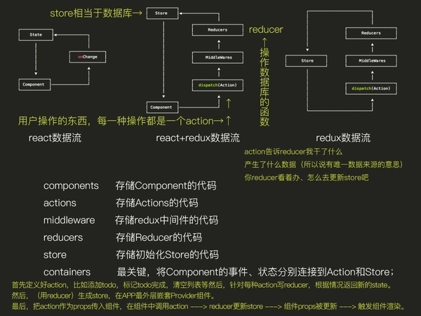

[toc]
# React
React 的核心思想是：封装组件，各个组件维护自己的状态和 UI，当状态变更，自动重新渲染整个组件。

基于这种方式的一个直观感受就是我们不再需要不厌其烦地来回查找某个 DOM 元素，然后操作 DOM 去更改 UI。

React 大体包含下面这些概念：

* 组件
* JSX
* Virtual DOM
* Data Flow


## React版本历史
React版本中比较重点的几个版本介绍

### jsxtransformer.js、browser.js、babel.js

在react 0.14前，浏览器端实现对jsx的编译依赖jsxtransformer.js 
在react 0.14后，这个依赖的库改为browser.js
页面script标签的type也由text/jsx改为text/babel
但是以上只能用来测试学习react
生产环境需要借助编译工具事先将jsx编译成js
对应的这个工具也由react-tool更换为babel

babel.js与browser.js的关系
babel的浏览器版本为browser.js

Babel是React团队选择的在使用React过程中转换ES*和JSX为ES5语句的工具

实际上，Babel的主要用途并非一个JSX语句转换器。Babel主要用途是一个JavaScript转换器，它可以转换各种ES*代码为浏览器可识别的ES代码。就目前来说，Babel主要会转换ES6和ES7语句为ES5语句，转换JSX看起来倒像是其的一个附加功能。


### React 0.14

React Router 的作者说过版本号永远和 React 保持一致，从 v0.10 开始确实如此。然后 v0.11，v0.12，v0.13，眼看着时间已经过去了一年多……怎么着也该出 v1.0 了吧，结果 React 发布了 v0.14，而且还规划了 v0.15，让 React Router 的若干个 v1.0-beta 版本哭瞎在厕所。

**React 「一分为二」**

原本的 react package 被拆分为 react 及 react-dom 两个 package。其中 react package 中包含 React.createElement、 .createClass、 .Component， .PropTypes， .Children这些 API，而 react-dom package 中包含 ReactDOM.render、 .unmountComponentAtNode、 .findDOMNode。

原本在服务端渲染用的两个 API .renderToString 和 .renderToStaticMarkup 被放在了 react-dom/server 中。

此外，原本 React.addons 下面的工具全部变成了独立的 package

原本的 API 在 v0.14 版中仍然可以使用，只不过会有 warning，最终会在 v0.15 版的时候完全移除。

**refs 变成了真正的 DOM 节点**

当我们需要获取 React 组件上某个 DOM 节点时，React 提供了 refs 方法方便我们快速引用。为了方便我们使用，React 还「贴心」地对 refs 做了一层封装，使用 this.refs.xxx.getDOMNode() 或 React.findDOMNode(this.refs.xxx) 可以获取到真正的 DOM 节点。
结果发现大家真正需要的就是 DOM 节点本身，封装了半天完全是浪费感情。
于是在 v0.14 版中 refs 指向的就是 DOM 节点，同时也会保留 .getDOMNode() 方法（带 warning），最终在 v0.15 版中去除该方法。
需要注意的是，如果你给自定义的 React 组件（除了 DOM 自带的标签，如 div、p 等）添加 refs，表现和行为与之前一致。

**无状态的函数式组件**

其实在实际业务系统中使用 React 时，我们会写很多只有 render 方法的 React 组件。为了减少冗余的代码量，React v0.14 中引入了 无状态的函数式组件（Stateless functional components） 的概念
```javascript
// 一个 ES6 箭头函数定义的无状态函数式组件
var Aquarium = (props) => {
  var fish = getFish(props.species);
  return <Tank>{fish}</Tank>;
};

// 或者更加简化的版本
var Aquarium = ({species}) => (
  <Tank>
    {getFish(species)}
  </Tank>
);

// 最终使用方式: <Aquarium species="rainbowfish" />
```

**react-tools 及 JSXTransformer.js 已弃用**

**其它变化**

* React.initializeTouchEvents 已弃用
* 由于 refs 的相关变化（见上文），TestUtils.findAllInRenderedTree 及相关的方法不再接受 DOM 组件作为参数，只能传入自定义的 React 组件
* props 一旦创建永远不可修改，因此 .setProps 及 .replaceProps 已废弃
* children 不可以传对象类型，推荐传入数组，或使用 React.createFragment 方法（其实就是转换为了数组）
* React.addons.classSet 已经移除，使用 classnames package 替代


[React v0.14 概览](http://undefinedblog.com/react-v0-14/)
### React 15.4.2
### React 16
## React入门

使用react的时候，需要引用 react.js 和 react-dom.js 这两个js文件以及browser.js。 **并非必需引入browser.js**，引入它的作用是使浏览器支持babel，你可以使用ES2015进行编码。如果你用ES5，可以不引入。

* react.js - **React 的 核心库**
* react-dom.js - **提供与 DOM 相关的功能 **
* browser.js 是 **将 JSX 语法转为 JavaScript 语法** ，这一步 很消耗时间 ，实际上线的时候，应该将它放到服务器完成。（转换只要在 浏览器解析之前就可以了）
* babel.min.js - Babel 可以将 ES6 代码转为 ES5 代码，这样我们就能在目前不支持 ES6 浏览器上执行 React 代码。Babel 内嵌了对 JSX 的支持。通过将 Babel 和 babel-sublime 包（package）一同使用可以让源码的语法渲染上升到一个全新的水平

React 独有的 JSX 语法，跟 JavaScript 不兼容。 凡是使用 JSX 的地方，都要加上 type="text/babel" 。

browser.js 是Babel提供的转换器脚本，可以在浏览器运行。用户的ES6脚本放在 script 标签之中，但是要注明 type="text/babel" 。

>
**ReactDOM.render()** 实例化根组件，启动框架，注入标记到原始的 DOM 元素中。

React 组件使用一个名为** render() **的方法，该方法返回一颗 React 组件树，这棵树最终将会渲染成 HTML。（ 接收数据作为输入，输出页面中对应展示的内容。）


### 核心概念

#### 组件

可以这么说，一个 React 应用就是构建在 React 组件之上的。

props 是组件包含的两个核心概念之一，另一个是 state。可以把 props 看作是组件的配置属性，在组件内部是不变的，只是在调用这个组件的时候传入不同的属性来定制显示这个组件。

[React创建组件的三种方式及其区别](https://www.cnblogs.com/wonyun/p/5930333.html)

1. 获取属性的值用的是this.props.属性名
2. 创建的组件名称首字母必须大写。
3. 为元素添加css的class时，要用**className**。
4. 组件的style属性的设置方式也值得注意，要写成style==={{==width: this.state.witdh==}}==。
5. getInitialState函数必须有返回值，可以是NULL或者一个对象。
6. 访问state的方法是this.state.属性名。
7. 修改状态值要用setState方法。
8. 变量用{}包裹，不需要再加双引号。


**style 属性接受由 CSS 属性构成的 JS 对象**


**组件的生命周期**
组件的生命周期分成三个状态：

* Mounting：已插入真实 DOM
* Updating：正在被重新渲染
* Unmounting：已移出真实 DOM

React 为每个状态都提供了两种处理函数，will 函数在进入状态之前调用，did 函数在进入状态之后调用，三种状态共计五种处理函数。

* componentWillMount() 装载组件
只会在装载之前调用一次，在 render 之前调用，你可以在这个方法里面调用 setState 改变状态

* componentDidMount()
只会在装载完成之后调用一次，在 render 之后调用

* componentWillUpdate(object nextProps, object nextState)
* componentDidUpdate(object prevProps, object prevState)
* componentWillUnmount()

此外，React 还提供两种特殊状态的处理函数。

* componentWillReceiveProps(object nextProps)：已加载组件收到新的参数时调用
* shouldComponentUpdate(object nextProps, object nextState)：组件判断是否重新渲染时调用


**getInitialState**
初始化 this.state 的值，只在组件装载之前调用一次。

**getDefaultProps**
只在组件创建时调用一次并缓存返回的对象；
因为这个方法在实例初始化之前调用，所以在这个方法里面不能依赖 this 获取到这个组件的实例。

**render**
组装生成这个组件的 HTML 结构（使用原生 HTML 标签或者子组件），也可以返回 null 或者 false

### props vs state

在React里有两种数据 "模型": props 和 state，它们同时也是组件的两个核心概念

props 就是组件的属性，由外部通过 JSX 属性传入设置，一旦初始设置完成，就可以认为 this.props 是不可更改的，所以不要轻易更改设置 this.props 里面的值（虽然对于一个 JS 对象你可以做任何事）。

state 是组件的当前状态，可以把组件简单看成一个“状态机”，根据状态 state 呈现不同的 UI 展示。
一旦状态（数据）更改，组件就会自动调用 render 重新渲染 UI，这个更改的动作会通过 this.setState 方法来触发。

**划分状态数据**
一条原则：让组件尽可能地少状态。
这样组件逻辑就越容易维护。

什么样的数据属性可以当作状态？
当更改这个状态（数据）需要更新组件 UI 的就可以认为是 state

## ES6
涉及到的常用知识点

* 箭头函数 Arrow functions
* 对象解构 Object destructuring
* 类 Classes
* 展开操作符 The spread operator

ES6入门资料

* [Practical ES6](https://ponyfoo.com/books/practical-modern-javascript/chapters)
* [ECMAScript 6入门](http://es6.ruanyifeng.com/)

## 设计思想
1. [React 设计思想](https://github.com/react-guide/react-basic)
2. [React的设计哲学 - 简单之美](http://www.infoq.com/cn/articles/react-art-of-simplity/)
3. [颠覆式前端UI开发框架:React](http://www.infoq.com/cn/articles/subversion-front-end-ui-development-framework-react/)

## 学习资料
[JavaScript全栈教程](https://www.liaoxuefeng.com/wiki/001434446689867b27157e896e74d51a89c25cc8b43bdb3000)
[JavaScript 标准参考教程](http://javascript.ruanyifeng.com/)
[JavaScript MDN](https://developer.mozilla.org/zh-CN/docs/Web/JavaScript)
[React 学习资源汇总](https://www.ctolib.com/topics-79199.html)
[十分详细的React入门实例](https://blog.csdn.net/a153375250/article/details/52667739)

[React架构的静态站点生成器 Gatsby](https://github.com/gatsbyjs/gatsby)
[React中文文档-chenyitian](https://chenyitian.gitbooks.io/react-docs/content/)

## 其他

### Redux
在React阵营里，Redux是最受欢迎的状态管理库。Redux不仅能帮助你集中管理数据，同样可以将对数据的操作限制在一定规范内。


你可以将Redux想象成一个银行：你不能直接修改你账户的存款数字（来来来，让我在后面多加几颗零吧！）。而是需要填写存款表单，让银行出纳认证后来完成这个操作。
相似的，Redux也不允许你直接修改全局state的数据。而是通过向reducers传递actions来进行，reducer其实就是一个接收旧状态和操作返回新状态的方法。

[Redux 教程](https://learnredux.com/)
[egghead.io上的视频教程](https://egghead.io/courses/getting-started-with-redux)

### GraphQL
由Fackbook开源的项目[GraphQL](http://graphql.org/)，它可以作为传统REST APIs的替代解决方案。
不同于REST API根据你预先定义的数据集（例如 /api/posts, /api/comments, etc.）分发出不同的REST路径。GraphQL可以让你只通过一个数据端像操作数据库一样按需查询数据。
这种新的策略在你需要请求多组数据源的时候非常有意义。你只需要一次请求就可以获取所有的数据。

GraphQL本身只是一项协议，它最好的实现是能和Redux非常好地协同的[Apollo](https://www.apollographql.com/)这个库。现在网上的相关教程确实比较少，不过[Apollo](https://www.apollographql.com/client/)官方文档   已经能让你很好地了解它了。

### Elm
[Elm](http://elm-lang.org/)不仅是一个框架，更是一种建立在JavaScript之上的语言，类似CoffeeScript/TypeScript等。
它有很多优点，例如性能提升，语义化的版本，没有运行异常等。


