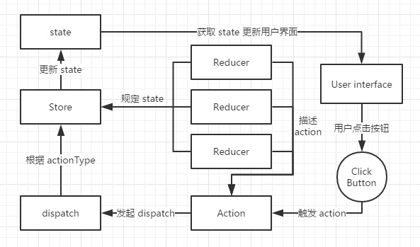
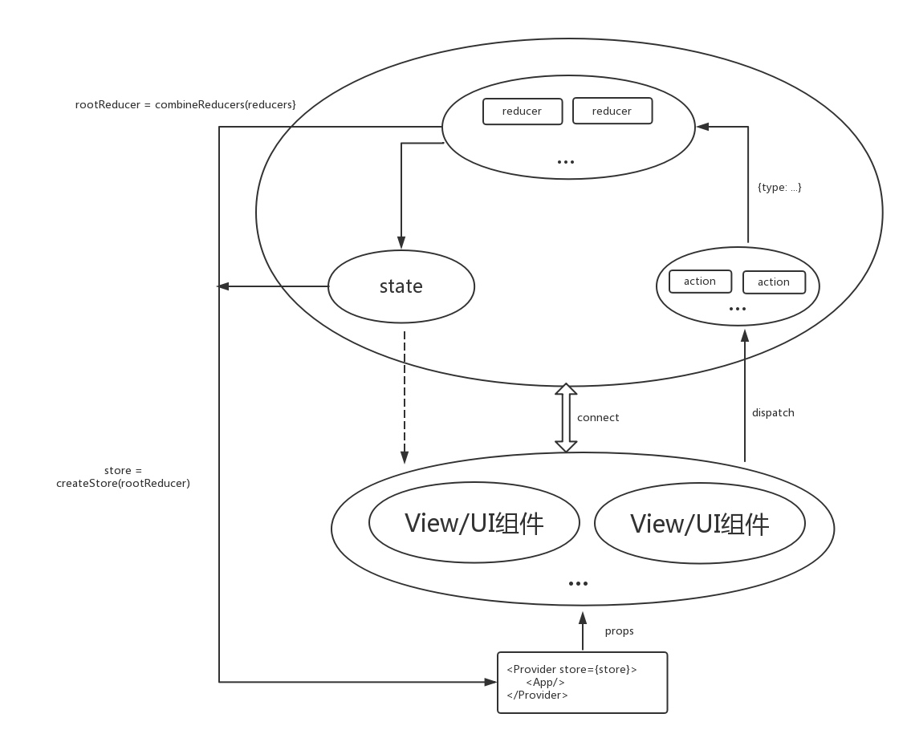
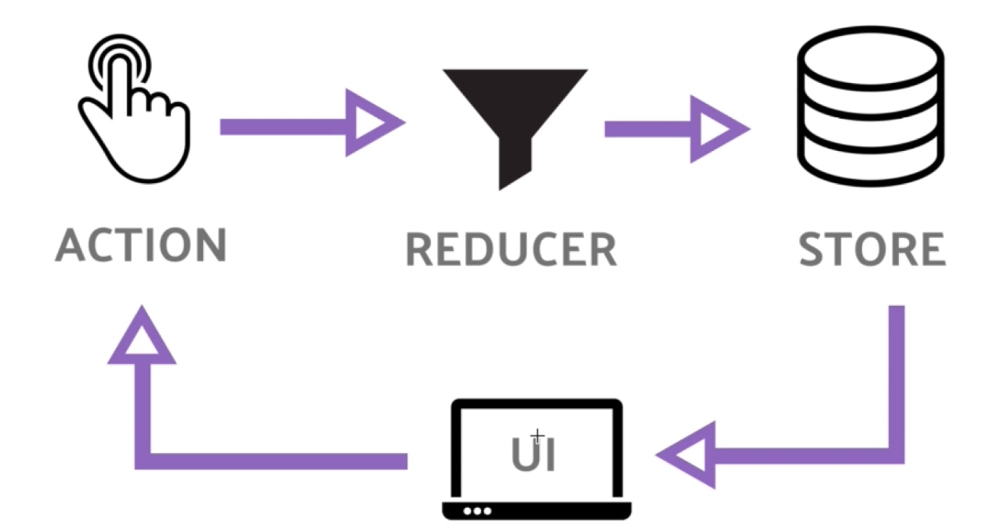
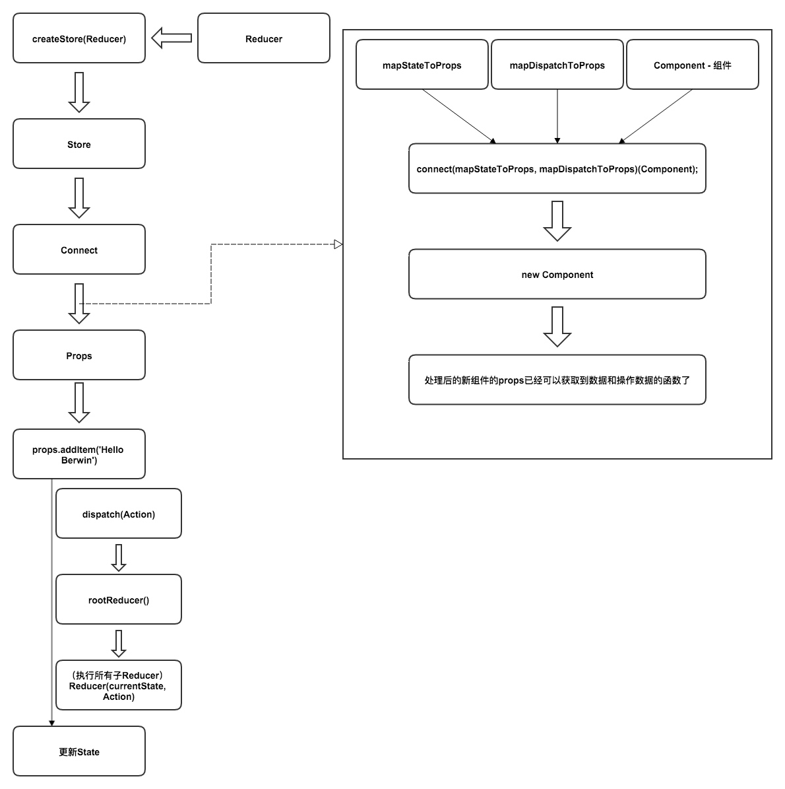

# Redux相关概念

[随机获取一个用户信息](https://randomuser.me/)

## Redux起源

React 只是 DOM 的一个抽象层，并不是 Web 应用的完整解决方案。有两个方面，它没涉及。
>
 * 代码结构
 * 组件之间的通信

对于大型的复杂应用来说，这两方面恰恰是最关键的。因此，只用 React 没法写大型应用。

为了解决这个问题，2014年 Facebook 提出了 Flux 架构的概念，引发了很多的实现。2015年，Redux 出现，将 Flux 与函数式编程结合一起，很短时间内就成为了最热门的前端架构。

## 预备知识
需要懂 React

Redux 有很好的[文档](https://redux.js.org/)，还有配套的小视频（[前30集](https://egghead.io/courses/getting-started-with-redux)，后30集）

## 设计思想

> 
（1）Web 应用是一个状态机，视图与状态是一一对应的。
（2）所有的状态，保存在一个对象里面。

## 基本概念和 API


## Redux

对于复杂的 SPA，状态（state）管理非常重要。state 可能包括：服务端的响应数据、本地对响应数据的缓存、本地创建的数据（比如，表单数据）以及一些 UI 的状态信息（比如，路由、选中的 tab、是否显示下拉列表、页码控制等等）。如果 state 变化不可预测，就会难于调试（state 不易重现，很难复现一些 bug）和不易于扩展（比如，优化更新渲染、服务端渲染、路由切换时获取数据等等）。

> state 为单一对象，使得 Redux 只需要维护一棵状态树，服务端很容易初始化状态，易于服务器渲染。state 只能通过 dispatch(action) 来触发更新，更新逻辑由 reducer 来执行。


项目中看到的结构是：
```
├─store
├─actions
├─reducers
├─constants
├─helpers
├─components
├─app.js
├─favicon.ico
├─index.html
├─index.js
└─routes.js
```
获取 state 需要在组件中调用 connect 函数，可以自行定义需要获取的 state。
**connect 必须紧跟 component 的定义，不然会报错。**


图上可以看出，store，state，reducer，action其实最后都只有一个，我们只是为了代码逻辑将其分为多个，层次分明，便于开发和阅读。

一句话总结，View只负责UI界面，不存在私有的state和操作，redux将View中的state和操作集中起来在store中管理，然后通过props将修改后的state内容传递给View，界面发生变化。用户操作界面，View通过dispatch执行相关操作，然后将ActionType和Data交由reducer函数，根据ActionType和Data修改state。


[一幅图明白React-Redux的原理](https://juejin.im/post/5acdbe8f51882548fe4a7af1)





action: 行为和动作
reducer:  返回state（或者说是返回数据）


## React-redux

如果要将 Redux 和 React 结合起来使用，就还需要一些额外的工具，其中最重要的莫过于 react-redux 了。

react-redux 提供了两个重要的对象， **Provider** 和 **connect** ，前者使 React 组件可被连接（connectable），后者把 React 组件和 Redux 的 store 真正连接起来。




## Redux 和 React-redux区别

[redux](https://github.com/reduxjs/redux): Predictable state container for JavaScript apps 
 + 提供 **createStore**
 

[react-redux](https://github.com/reduxjs/react-redux): Official React bindings for Redux
 + 提供 **Provider** 和 **connect**


## 参考资料
[Redux 入门教程](http://www.ruanyifeng.com/blog/2016/09/redux_tutorial_part_one_basic_usages.html)
[react-redux 之 connect 方法详解](https://blog.csdn.net/u010977147/article/details/53412381)
[深入浅出 - Redux ](https://github.com/berwin/Blog/issues/4)

[React 实践心得：react-redux 之 connect 方法详解](http://taobaofed.org/blog/2016/08/18/react-redux-connect/)
[MapStateToProps & MapDispatchToProps & Connect](https://noootown.gitbooks.io/deeperience-react-native-boilerplate/content/Redux/MapStateToProps%20&%20MapDispatchToProps%20&%20Connect.html)

[React知识地图--Redux](https://github.com/YutHelloWorld/Blog/issues/3)

[在 2017 年学习 React + Redux 的一些建议](https://github.com/iuap-design/blog/issues/179)


[分享一个 react + redux 完整的项目，同时写一下个人感悟](http://react-china.org/t/react-redux/9072/37)

