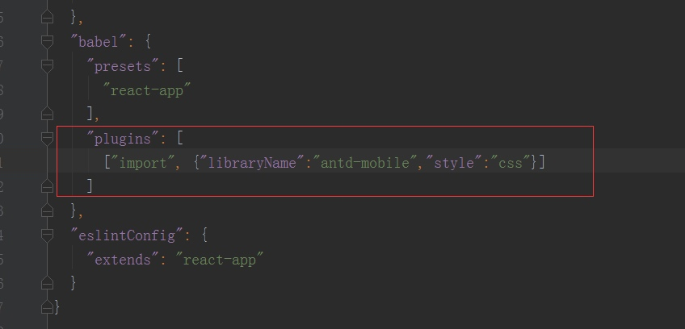
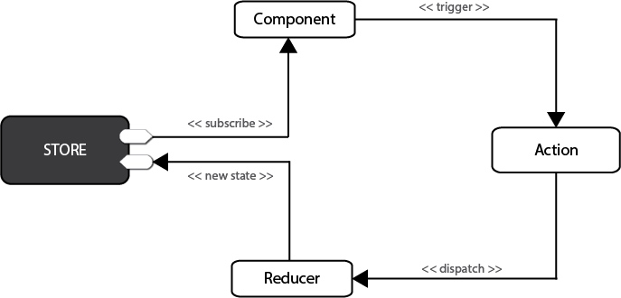

[toc]

# react包介绍

## react-redux和react-router-redux有什么区别

**react-redux**: 把react的state 集成到redux的store上，让redux来管理react组件的状态
**react-router-redux**：把react-router url的变化、参数等信息作为状态，交给redux的store管理，一般场景下直接使用react-router即可，因为url的这些状态比较独立，不一定非要交给redux来管理的。

## react-router
https://reacttraining.com/react-router/

## redux-router
https://github.com/acdlite/redux-router

**The README for react-router-redux has a useful picture included here:**
redux (store.routing)  ↔  react-router-redux  ↔  history (history.location)  ↔  react-router

**The picture of redux-router would look more like this:**
redux (store.router)  ↔  redux-router  ↔  react-router (via RouterContext)
## react-router-dom
https://github.com/ReactTraining/react-router
## react-redux
http://redux.js.org/docs/basics/UsageWithReact.html

# 项目搭建
create-react-app 自动创建的项目是基于 Webpack + ES6 

## creact-react-app配合router和redux


## 利用create-react-app结合react-redux、react-router4构建单页应用
1.创建项目：
　　a.全局安装create-react-app: npm  install  create-react-app  -g
       b.执行create-react-app  my-projectName创建自己的项目，完成之后npm run  start即可启动项目。
2.引入组件库、插件配置等:
　　a.执行npm install  antd-mobile  --save安装组件库
　　b.执行npm install  babel-plugin-import  --save安装按需加载插件
　　c.执行npm  run  eject  弹出个性化配置，在package.json中的babel配置项添加按需加载插件配置:

3.引入redux、react-redux
　　a.执行npm install  redux  --save安装redux 
　　b.执行npm install  redux-thunk安装thunk插件，使redux可处理异步操作
　　c.执行npm install  react-redux  --save安装react-redux简化参数传递
　　d.执行npm  install  babel-plugin-transform-decorators-legacy --save-dev安装此插件支持connect的装饰器写法
　
4.引入react-router4
　　a.执行npm  install  react-router-dom  --save


# react-redux流程

redux 分为三大部分，store ， action ，reducer

## 目录结构组织
使用ducks方式组织redux目录结构
https://www.jianshu.com/p/324fd1c124ad
https://segmentfault.com/a/1190000010915166

## 流程
简化版的流程是：
一、Provider组件接受redux的store作为props，然后通过context往下传。
二、connect函数收到Provider传出的store，然后接受三个参数mapStateToProps，mapDispatchToProps和组件，并将state和actionCreator以props传入组件，这时组件就可以调用actionCreator函数来触发reducer函数返回新的state，connect监听到state变化调用setState更新组件并将新的state传入组件。
connect可以写的非常简洁，mapStateToProps，mapDispatchToProps只不过是传入的回调函数，connect函数在必要的时候会调用它们，名字不是固定的，甚至可以不写名字。
简化版本：connect(state => state, action)(Component);



在Redux中，所有的数据（比如state）被保存在一个被称为store的容器中 → 在一个应用程序中只能有一个。store本质上是一个状态树，保存了所有对象的状态。任何UI组件都可以直接从store访问特定对象的状态。要通过本地或远程组件更改状态，需要分发一个action。分发在这里意味着将可执行信息发送到store。当一个store接收到一个action，它将把这个action代理给相关的reducer。reducer是一个纯函数，它可以查看之前的状态，执行一个action并且返回一个新的状态。


## .prettierrc 格式化插件配置
https://prettier.io/playground/

格式化插件配置
```
{
  "printWidth": 120,               // 换行字符串阈值
  "semi": true,                    // 句末加分号
  "singleQuote": true,             // 用单引号
  "trailingComma": "none",         // 最后一个对象元素加逗号
  "bracketSpacing": true,          // 对象，数组加空格
  "jsxBracketSameLine": false,     // jsx > 是否另起一行
  "arrowParens": "avoid",          // (x) => {} 是否要有小括号
  "requirePragma": false,          // 是否要注释来决定是否格式化代码
  "proseWrap": "preserve"          // 是否要换行
}
```


