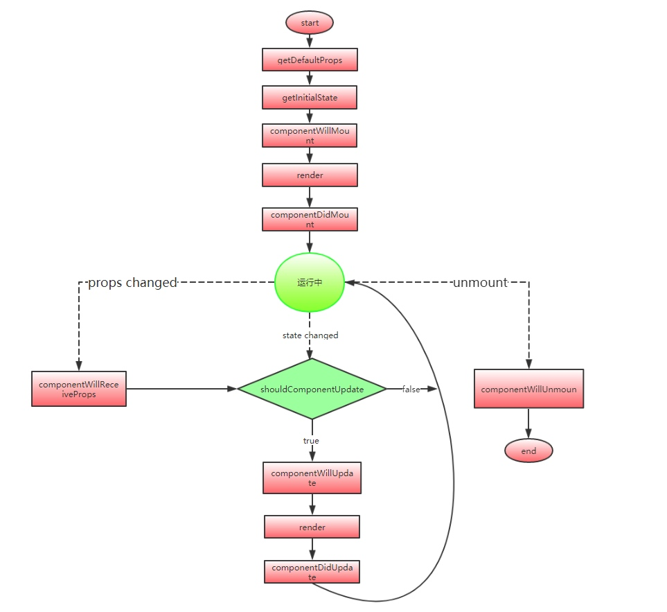
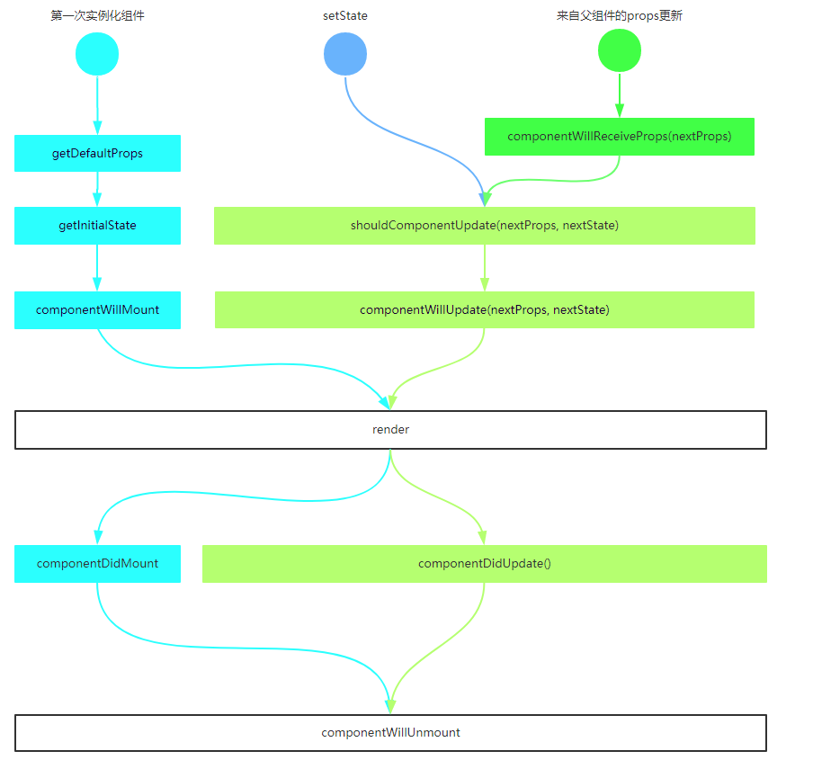
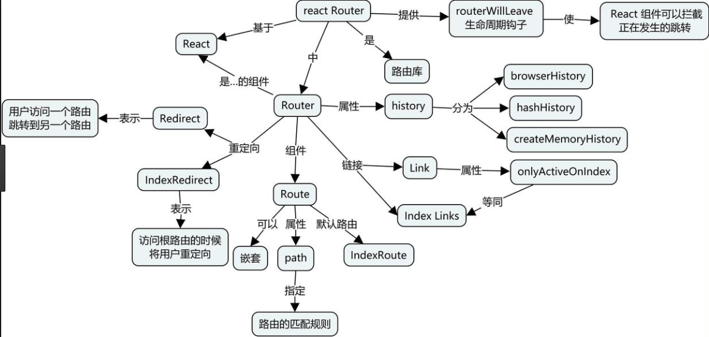
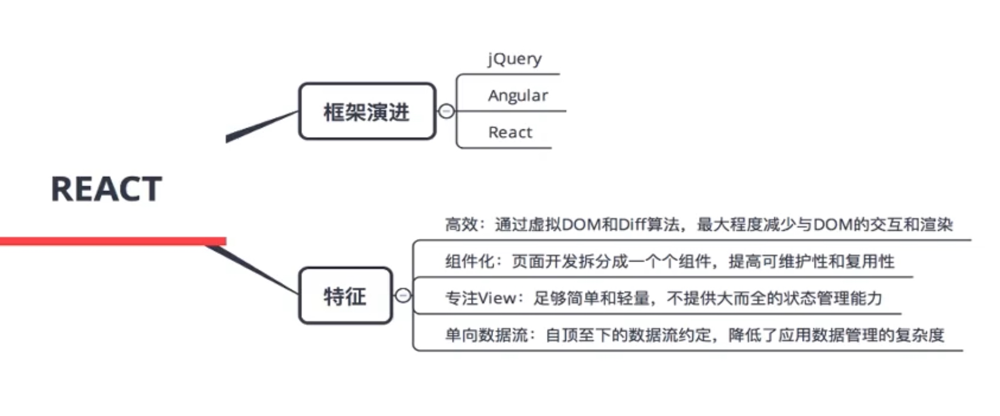
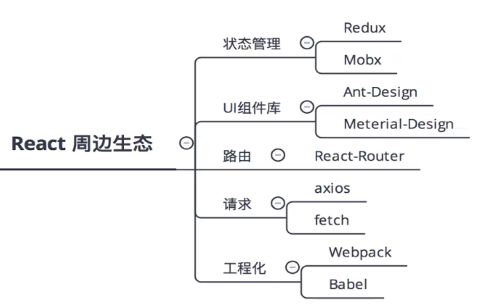
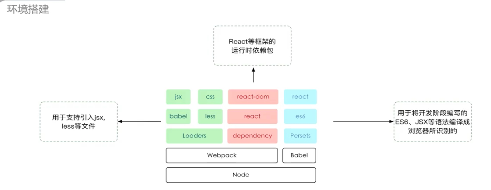

# React视频教程总结


> 1、不管知识有多新、项目有多难，只要来了什么姿势都得上；
>
> 2、没人疼，没人爱，团队中没人能帮自己，需要借助外力。（看视频、Google）；
>
> 3、积极要求进步勇当三八红旗手；

## React应用场景

1. 复杂场景下的高性能（比如类似web应用类型的）
2. 组件高度可重用，可组合

   

## React基础

jsx语法糖：方便使用和易读的一种代码书写方式，不影响代码的功能

### jsx中样式的使用

1. 使用className添加类名，比如直接添加`<div className="txt"></div>`，如果是变量的话`<div className={变量名}`
2. 使用行内样式style, 比如`<div style={{color: 'red', fontSize: '12px'}}`, 双大括号，属性名用小驼峰

### 组件中this

组件中的方法是被组件自身调用的，所以组件的方法对应的this是指组件本身——在使用`React.createClass` 时可以这么理解;

* 使用`React.createClass` 时 `React` 会自动帮我们处理函数中的 `this` 指针

* 使用`React.Component时`由于使用了 ES6，这里会有些微不同，属性this并不会自动绑定到 React 类的实例上

  1. 在`constructor`中绑定，比如`this.handleClick = this.handleClick.bind(this)`;

  2. 使用箭头函数，箭头函数中的this指的是函数定义时所在宿主对象

     ```jsx
     handleClick = (e) => {
         this.setState({
             count: this.state.count + 1
         });
     }
     ```

     

  3. 在行内代码中绑定正确的执行上下文，比如

     ```jsx
      render() {
         return (
           <div onClick={this.handleClick.bind(this)}></div>
         );
       }
     ```

     

this四种用法，详情：慕课网“JavaScript深入浅出”-this节


### 组件的state和props

1. **props**

- 在`React`中，`props`都是自上向下传递，从父组件传入子组件
- `props` 几乎可以传递所有的内容，包括变量、函数、甚至是组件本身
- **props是只读的**，组件只能根据传入的`props`渲染界面，而不能在其内部对`props`进行直接修改

**props类型检查**

**props默认值**

**props.children**

2. **state**

- `setState`方法，修改state的值
- 初始化，在类定义组件的构造方法中初始化state默认值


### 组件的生命周期

应用界面更新的过程分为两个主要的部分： **调度过程** 和 **执行过程**

在**调度过程**中，有4个生命周期函数会被触发

> - `componentWillMount`
> - `componentWillReceiveProps`
> - `shouldComponentUpdate`
> - `componentWillUpdate`

在**执行过程**中，有3个生命周期函数会被触发：

> - `componentDidMount`
> - `componentDidUpdate`
> - `componentWillUnmount`

`React`为了方便我们更好地控制自己的应用，提供了许多预置的生命周期方法。这些固定的生命周期方法分别会在组件的挂载流程、更新流程、卸载流程中触发

- `componentWillMount` 开始插入真实DOM
- `componentDidMount` 插入真实`DOM`完成
- `componentWillUpdate` 开始重新渲染
- `componentDidUpdate` 重新渲染完成
- `componentWillUnmount`已移出真实 `DOM`
- `componentWillReceiveProps` 已加载组件收到新的参数时调用
- `shouldComponentUpdate`组件判断是否重新渲染时调用

 
      

**componentDidMount**

> 在此方法中可进行
>
> - 与其他 `JavaScript` 框架集成，如初始化 `jQuery` 插件；
> - 使用 `setTimeout`/`setInterval` 设置定时器；
> - 通过 `Ajax`/`Fetch` 获取数据；
> - 绑定 `DOM` 事件

- React组件渲染包含三个流程：挂载流程、更新流程、卸载流程
- 各个生命周期函数会在特定的时刻触发并适用于不同的使用场景
- 通过使用生命周期函数我们可以对应用进行更精准的控制
- 如果你需要发起网络请求，将其安排在合适的生命周期函数中是值得推荐的做法
- 了解掌握`React`组件渲染的流程和原理对我们更深入掌握`React`非常有帮助


### 组件的事件处理

事件传递参数有两种形式

1. 通过箭头函数` <button onClick={() => this.handlerClick('参数')}>点击</button>`
2. 通过bind函数 ` <button onClick={this.handlerClick.bind(this,'参数')}>点击</button>`

#### 组件类型

1. 根据写法的不同分为 **纯函数组件** 和 **类定义组件**

1.1 **纯函数组件**：接收props传值，返回React元素

````jsx
//普通写法
function Title(props) {
  return <h1>Hello, {props.name}</h1>
}

//ES6写法，箭头函数
const Title = props => <h1>Hello, {props.name}</h1>
````

1.2 **类定义组件**：使用ES6引入的类的概念定义React组件

```jsx
class Title extends React.Component {
  constructor(props) {
    super(props);
  }
  render() {
    return <h1>Hello, {this.props.name}</h1>
  }
}
```

2. 根据功能或者作用的不同分为 **展示组件** 和 **容器组件**，解耦了界面和数据的逻辑，提高了可复用性，利于团队协作

2.1 **展示组件** ：主要负责组件内容如何展示，通过`props`接收父组件传递来的数据，大多数情况可以通过函数定义组件声明

```jsx
// 展示组件
class CommentList extends React.Component {
  constructor(props) {
    super(props)
  }

  renderComment({body, author}) {
    return <li>{body}—{author}</li>
  }
  
  render() { 
    return <ul> {this.props.comments.map(this.renderComment)} </ul>
  } 
  
}
```

2.2 **容器组件**：主要关注组件数据如何交互，拥有自身的`state`，从服务器获取数据，或与`redux`等其他数据处理模块协作，需要通过类定义组件声明，并包含生命周期函数和其他附加方法

```jsx
// 容器组件
class CommentListContainer extends React.Component {
  constructor() {
    super()
    this.state = { comments: [] }
  }
  
  componentDidMount() {
    $.ajax({
      url: "/my-comments.json",
      dataType: 'json',
      success: function(comments) {
        this.setState({comments: comments})
      }.bind(this)
    })
  }
  
  render() {
    return <CommentList comments={this.state.comments} />
  }
}
```

3. 根据是否有局部state分为 **无状态组件** 和 **有状态组件**

   3.1 **无状态组件**：这样的组件一般只接收来自其他组件的数据。一般这样的组件中只能看到对`this.props`的调用

   ```jsx
   // 无状态组件
   class StatelessLink extends React.Component {
     constructor(props) {
       super(props)
     }
     handleClick() {
       this.props.handleClick(this.props.router)
     }
     render() {
       const active = this.props.activeRouter === this.props.router
       return (
           <li>
               <a 
                 style={{ color: active ? 'red' : 'black' }}
                 onClick={this.handleClick.bind(this)}
                >
                   Stateless Link
               </a>
           </li>
       )
     }
   }
   ```

   3.2 **有状态组件**：这个组件能够获取储存改变应用或组件本身的状态数据，在`React`当中也就是`state`，一些比较明显的特征是我们可以在这样的组件当中看到对`this.state`的初始化，或`this.setState`方法的调用

   ```jsx
   // 有状态组件
   class StatefulLink extends React.Component {
     constructor(props) {
       super(props)
       this.state = {
         active: false
       }
     }
     handleClick() {
       this.setState({
         active: !this.state.active
       })
     }
     render() {
       return <a 
             style={{ color: this.state.active ? 'red' : 'black' }}
             onClick={this.handleClick.bind(this)}
            >
              Stateful Link
            </a>
     }
   }
   ```

   在`React`的实际开发当中，我们编写的组件大部分都是无状态组件。毕竟`React`的主要作用是编写用户界面。再加上`ES6`的新特性，绝大多数的无状态组件都可以通过箭头函数简写成类似下面这样

   ```jsx
   const SimpleButton = props => <button>{props.text}</button>
   ```

   4. 根据表单元素如input是否有`value`属性分为**受控组件** 和 **非受控组件**，受控与非受控组件就是专门适用于React当中的表单元素的

      

      4.1 **受控组件**： 可以通过初始state中设置表单的默认值; 每当表单的值发生变化时,调用onChange事件处理器; 事件处理器通过合成事件对象e拿到改变后的状态,并更新应用的state; setState触发视图的重新渲染,完成表单组件值得更新

      ```jsx
      import React, { Component } from 'react';
      
      class Controlled extends React.Component {
        constructor(props) {
          super(props);
          this.state = {value: ''};
      
          this.handleChange = this.handleChange.bind(this);
          this.handleSubmit = this.handleSubmit.bind(this);
        }
      
        handleChange(event) {
          this.setState({value: event.target.value});
        }
      
        handleSubmit(event) {
          alert('A name was submitted: ' + this.state.value);
          event.preventDefault();
        }
      
        render() {
          return (
            <form onSubmit={this.handleSubmit}>
              <label>
                Name:
                /*① 设置表单元素的value属性之后，其显示值将由this.state.value决定，以满足React状态的同一数据理念。*/
                /*② 每次键盘敲击之后会执行handleChange方法以更新React状态，显示值也将随着用户的输入改变。*/
                <input type="text" value={this.state.value} onChange={this.handleChange} />
              </label>
              <input type="submit" value="Submit" />
            </form>
          );
        }
      }
      
      export default Controlled;
      ```

      

      4.2 **非受控组件**：如果一个表单组件没有value props(单选按钮和复选按钮对应的是 checked props)时,就可以称为非受控组件; 使用defaultValue和defaultChecked来表示组件的默认状态; 通过 defaultValue和defaultChecked来设置组件的默认值,它仅会被渲染一次,在后续的渲染时并不起作用

      ```jsx
      import React, { Component } from 'react';
      
      class UnControlled extends React.Component {
        constructor(props) {
          super(props);
          this.handleSubmit = this.handleSubmit.bind(this);
        }
      
        handleSubmit(event) {
          alert('A name was submitted: ' + this.input.value);
          event.preventDefault();
        }
      
        render() {
          return (
            <form onSubmit={this.handleSubmit}>
              <label>
                Name:
                <input type="text" ref={(input) => this.input = input} defaultValue="默认值" />
              </label>
              <input type="submit" value="Submit" />
            </form>
          );
        }
      }
      
      export default UnControlled;
      ```

      在 HTML 中，表单元素如 <input>，<textarea> 和 <select> 表单元素通常保持自己的状态，并根据用户输入进行更新。而在 React 中，可变状态一般保存在组件的 state(状态) 属性中，并且只能通过 setState() 更新。


### 调试错误方式

1. `console.log()`打印出相应的内容
2. 浏览器打断点或者代码中加**debugger**打断点
3. 


## redux-router




## 技术入门








## redux

### Redux 的适用场景

- 某个组件的状态，需要共享
- 某个状态需要在任何地方都可以拿到
- 一个组件需要改变全局状态
- 一个组件需要改变另一个组件的状态

**Redux设计思想**

- `Web` 应用是一个状态机，视图与状态是一一对应的
- 所有的状态，保存在一个对象里面

### 基本概念和 API

