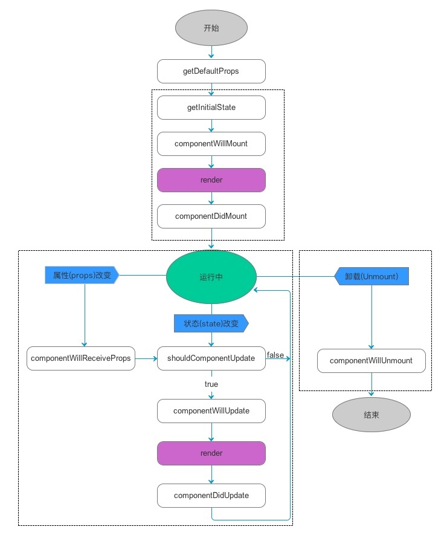

## 简介
项目整体架构
本项目是基于React的后台管理系统
后台项目主要涉及三大部分**核心库**、**中间件**和**公共封装模块**

## 核心库

### React

#### React特点

* 声明式
* 组件化
* Virtual DOM高效的DOM Diff算法
* 单向数据流

#### 生态介绍

* Vue生态：Vue + Vue Router + Vuex + Axios + Babel + Webpack
* React生态：React + React Router + Redux + Axios + Babel + Webpack

#### React脚手架、Yarn介绍

* React官方脚手架 [create-react-app](https://github.com/facebook/create-react-app)
* [Yarn](https://yarnpkg.com) - 新一代依赖包管理工具
  - 快速、可靠、安全的依赖管理工具
  - 输出更简洁
  - 更语义化

**yarn常用命令**

[yarn global](https://yarnpkg.com/en/docs/cli/global)

```
 yarn init //初始化生成package.json
 
 yarn install //根据package.json安装全部的依赖
 
 yarn global add packagenameA //全局安装packagenameA，global不能简写

 yarn add packagenameA // 安装packagenameA，安装 运行环境的依赖,同时会更新package.json

 yarn add --dev packagenameB //安装开发环境的依赖,同时会更新package.json

 yarn remove packagenameC //卸载指定包packagenameC,同时会更新package.json
```

**npm常用命令**

```
npm init //初始化生成package.json

npm install //根据package.json安装全部的依赖

npm install packagenameA -g //安装到全局，-g或者-global

npm install packagenameA //安装到本地
npm install packagenameA --save //安装到本地，同时会更新package.json
npm install packagenameA --save-dev //安装到本地，同时会更新package.json

npm uninstall packagenameA //卸载本地安装包
npm uninstall packagenameA --save //卸载本地安装包，同时会更新package.json
npm uninstall packagenameA --save-dev //卸载本地安装包，同时会更新package.json
```

#### React生命周期




componentWillMount
render
componentDidMount

componentWillReceiveProps

shouldComponentUpdate
shouldComponentUpdate(nextProps, nextState)方法，默认返回true，**调用setState之后就会触发更新，即使state没有变化**，由于触发之后父组件会调用render，所以即使父组件的state没有变化（也就是子组件的props也没有变化），子组件同样会调用componentWillReceiveProps和shouldComponentUpdate


componentWillUpdate
render
componentDidUpdate

componentWillUnmount

### React Router

#### 介绍

* `React Router 4` 版本中已不需要集中路由配置，**一切皆组件**
* `react-router` 提供了一些核心的API，包括Router, Route, Switch, Redirect等
* `react-router-dom` 包含`react-router`全部API，另外还有专门针对web应用的BrowserRouter, HashRouter, Link, NavLink等

#### react-router-dom核心用法

**HashRouter和BrowserRouter**

**Route: path exact component render**

参考：[初探 React Router 4.0](https://blog.csdn.net/sinat_17775997/article/details/69218382)

**NavLink和Link**

**Switch**

**Redirect**


#### react-router-dom路由实现的两种方式

**混合组件化**

**配置化**

### Redux

## 中间件

### Axios
### antd
### Echarts

## 公共封装模块

### 权限管理、菜单配置

路由单独集中配置，因为涉及到Switch, login等嵌套问题，所以不适合通过遍历的方式动态生成

菜单可以通过读取配置文件，遍历生成，同时根据role进行权限设置

### 消息通知
### API封装
### 错误拦截
### loading、分页封装
### 日期、金额、手机号、邮箱等工具库封装
### 表格、表单封装
### 主页面架构设计、Header、Footer

## Mock及联调


