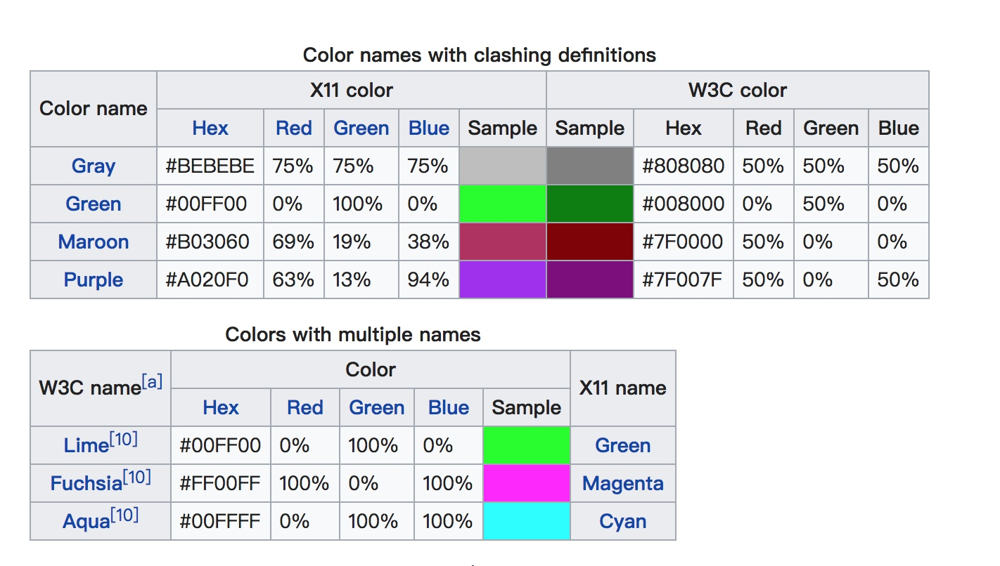

## RGB
 
X11也叫做X Window系统，X Window系统 (X11或X)是一种 位图 显示的 视窗系统 。它是在 Unix 和 类Unix 操作系统 ，以及 OpenVMS 上建立图形用户界面 的标准工具包和协议，并可用于几乎所有已有的现代操作系统。1984年出现的。

在W3C中 color name green对应的值是#008000， lime对应的值是#00ff00
在X11中 color name green对应的值是#00ff00

[X11 color names](https://en.wikipedia.org/wiki/X11_color_names#Color_names_that_clash_between_X11_and_HTML.2FCSS)

