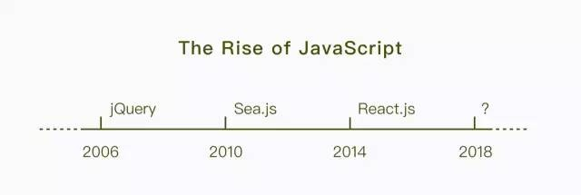

# 前端 Front End

## 前端的演变

经过了刀耕火种的以 jQuery 为代表的插件化时代，走过了曙光初现的以 Sea.js 为代表的模块化时代，前端终于迎来了以 React、Angular、Vue 为代表的组件化时代。站在今天的这个时间节点上，前端开发从未如此简单也从未如此复杂过。


随着 MVVM 框架、组件库、构建工具等前端基础设施建设的逐渐成熟，前端开发开始同时向着多个细分领域全面发力。横跨多端的大前端、工业化量产的中后台系统、代表着未来的数据可视化，每一个垂直领域都蕴含着巨大的机遇与挑战。

