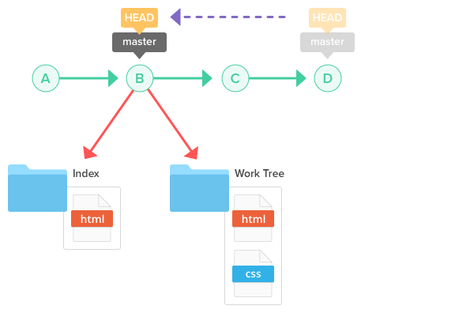
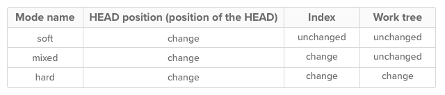
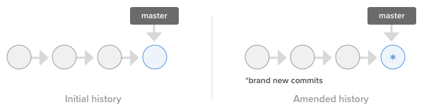
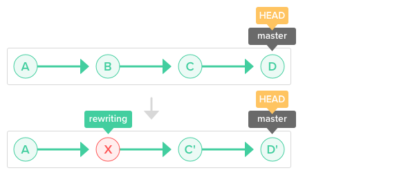
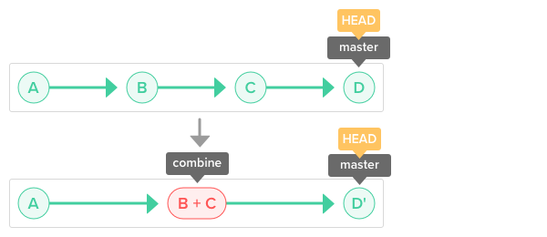
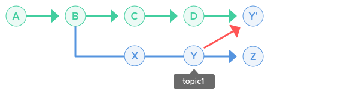
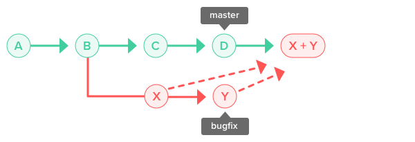

## What is git

A version control system like Git makes it easy to:

- Keep track of code history
- Collaborate on code as a team
- See who made which changes
- Deploy to staging or production


## Git workflow

There are three main components of a Git project:

- Repository
- Working tree
- Index

The **repository**, or repo, is the “container” that tracks the changes to your project files. It holds all the commits—a snapshot of all your files at a point in time—that have been made. You can access the commit history with the Git log.

The **working tree**, or working directory, consists of files that you are currently working on. You can think of a working tree as a file system where you can view and modify files.

The **index**, or staging area, is where commits are prepared. The index compares the files in the working tree to the files in the repo. When you make a change in the working tree, the index marks the file as modified before it is committed.

#### Below is the basic Git workflow:

1. Modify files in the working tree.
2. Stage the changes you want to be included in the next commit.
3. Commit changes. Committing will take the files from the index and store them as a snapshot in the repository.

### Three states of Git files

As you can probably guess from the Git workflow, files can be in one of three states:

- Modified
- Staged
- Committed


## Creating a repository

### Remote repositories and local repositories

There are two types of Git repositories: remote and local.

- A remote repository is hosted on a remote, or off-site, server that is shared among multiple team members.
- A local repository is hosted on a local machine for an individual user.

### How to create a repository

There are two ways to create a local repository on your machine. You can create a new repository from scratch using a file folder on your computer or clone an existing repository.

#### Git init

You can create a new repo from scratch using the **git init** command. It can be used to introduce Git into an existing, unversioned project in order to start tracking changes.

#### Git clone

Use the **git clone** command to copy a remote repository onto your local machine.

By default, **git clone** automatically sets up a local master branch that tracks the remote master branch it was cloned from.


## Recording changes

When committing your changes, you are required to enter a commit message. The commit message should provide descriptive comments regarding the changes you have made.

Write commit messages that are descriptive and easy to understand for all your team members. The following is a recommended structure for an effective Git commit message:

```shell
1st line: Abstract of the contents changed by commits
2nd line: Blank line
3rd line and the following lines: Reason for changes
```

## Undoing changes

There are two ways to undo changes: **git revert** and **git reset**.

### Git revert

You can use the **git revert** command to safely undo a commit that has already been pushed.

While you can also delete a previous commit from the history using **git reset**or **git rebase -i**, it is generally not a good idea because it causes the remote repository to become desynchronized with the local repositories of other members.


### Git reset

You can discard commits that you no longer need using the git reset command. You can specify the scope for the reset command by going into reset mode.



Use git reset to remove unnecessary commits.

There are three primary reset modes:

- Mixed (default)
- Soft
- Hard

Mixed mode restores the state of a changed index. Soft mode undoes a previous commit. Hard mode removes all traces of a commit. Below is a breakdown of each reset mode.

There are three reset modes: soft, mixed, and hard.


## Rewriting history

- Git commmit --amend
- Git rebase
- Git cherry pick
- Git merge --squash

There are times when you need to revise your local commit history. This can include anything from changing your commit message to changing the order of your commits to squashing commits together. In this section, we'll discuss how to rewrite history before sharing your work with others.

### Git commit --amend

You can modify the most recent commit in the same branch by running **git commit --amend**. This command is convenient for adding new or updated files to the previous commit. It is also a simple way to edit or add comments to the previous commit.

Use git commit --amend to modify the most recent commit.

### Git rebase

Rebasing is the process of taking all the changes that were committed on one branch and applying them to a new branch.

Run **git rebase** and add in the -i option to rewrite, replace, delete, and merge individual commits in the history. You can also:

- Rewrite a past commit message
- Squash a group of commits together
- Add files that have not been committed



Identify the commit you want to rewrite and run the git rebase -i command.

### Git cherry pick

You can apply an existing commit from another branch to the current branch within the repository by using the git cherry-pick command. Cherry-picking allows you to:

- Move a commit that was committed to the wrong branch to the right branch.
- Add a commit to the current branch based on an existing commit from another branch.

Use git cherry-pick to change the branch of a commit.

### Git merge --squash

Squashing is the process of merging multiple commits into a single commit.

If you run **git merge** and the **--squash** option, a new commit will group all of the commits from that branch together. The commit will be used to merge into the current branch.

Use git merge --squash to unifying commits from a feature/topic branch into a single commit to be merged into your current branch.

 